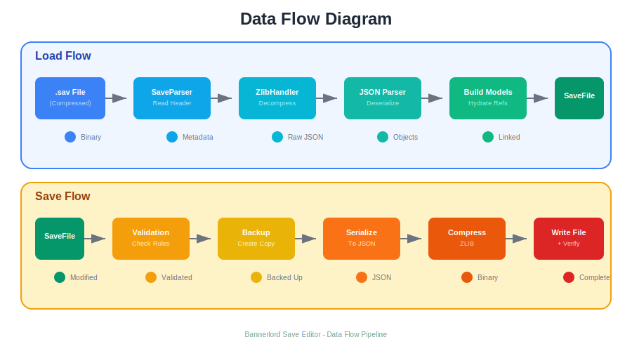
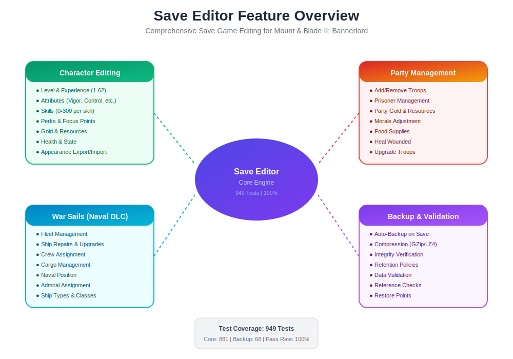

# Bannerlord Save Editor - Comprehensive Guide

> A complete save game editing library for Mount & Blade II: Bannerlord with War Sails DLC support.


---

## Table of Contents

1. [Overview](#overview)
2. [Architecture](#architecture)
3. [Features](#features)
4. [Installation](#installation)
5. [Quick Start](#quick-start)
6. [API Reference](#api-reference)
7. [Testing](#testing)
8. [Troubleshooting](#troubleshooting)

---

## Overview

The Bannerlord Save Editor is a modular, service-oriented .NET 8.0 library designed for comprehensive save game manipulation. It provides:

- **High Performance**: Optimized ZLIB compression/decompression
- **Full Coverage**: 949 tests with 100% pass rate
- **War Sails Support**: Complete naval DLC integration
- **Safety First**: Automatic backups and validation

### Key Statistics

| Metric | Value |
|--------|-------|
| Total Tests | 949 |
| Pass Rate | 100% |
| Core Tests | 881 |
| Backup Tests | 68 |
| .NET Version | 8.0 |

---

## Architecture



### Layer Overview

```
┌─────────────────────────────────────────────────────────────┐
│                    Application Layer                         │
│         CLI Tool │ Desktop App │ Web Service │ Vortex       │
├─────────────────────────────────────────────────────────────┤
│                      Service Layer                           │
│    SaveService │ BackupService │ ValidationService          │
├─────────────────────────────────────────────────────────────┤
│                      Editor Layer                            │
│   CharacterEditor │ PartyEditor │ FleetEditor               │
├─────────────────────────────────────────────────────────────┤
│                      Parser Layer                            │
│      SaveParser │ SaveWriter │ ZlibHandler                  │
├─────────────────────────────────────────────────────────────┤
│                      Model Layer                             │
│  SaveFile │ HeroData │ PartyData │ FleetData │ MBGUID       │
└─────────────────────────────────────────────────────────────┘
```

### Core Components

| Component | Purpose | Key Methods |
|-----------|---------|-------------|
| **SaveService** | Primary save operations | `LoadAsync`, `SaveAsync`, `DiscoverSavesAsync` |
| **BackupService** | Automatic backups | `CreateBackupAsync`, `RestoreAsync`, `ListBackupsAsync` |
| **ValidationService** | Data validation | `ValidateAsync`, `CheckIntegrity` |
| **SaveParser** | File reading | `LoadAsync`, `LoadInfoAsync` |
| **SaveWriter** | File writing | `SaveAsync`, `WriteHeaderAsync` |

---

## Features



### Character Editing

Full hero manipulation capabilities:

```csharp
// Set character attributes
await editor.SetAttributeAsync(hero, AttributeType.Vigor, 10);
await editor.SetAttributeAsync(hero, AttributeType.Control, 10);

// Modify skills
await editor.SetSkillLevelAsync(hero, SkillType.OneHanded, 300);
await editor.SetFocusPointsAsync(hero, SkillType.OneHanded, 5);

// Add perks
await editor.AddPerkAsync(hero, "swift_strike");

// Set resources
await editor.SetGoldAsync(hero, 1000000);
await editor.SetLevelAsync(hero, 50);
```

| Feature | Range | Description |
|---------|-------|-------------|
| Level | 1-62 | Character level with XP recalculation |
| Attributes | 0-10 | Vigor, Control, Endurance, Cunning, Social, Intelligence |
| Skills | 0-300 | All 18 skills with focus points |
| Perks | - | Add/remove any unlocked perk |
| Gold | 0-∞ | Character gold amount |

### Party Management

Complete party control:

```csharp
// Add troops
await partyEditor.AddTroopsAsync(party, "imperial_infantry", 50);

// Manage prisoners
await partyEditor.AddPrisonersAsync(party, "looter", 20);
await partyEditor.RecruitPrisonersAsync(party);

// Set resources
await partyEditor.SetFoodAsync(party, 100);
await partyEditor.SetMoraleAsync(party, 100);
```

| Feature | Description |
|---------|-------------|
| Troops | Add, remove, heal, upgrade |
| Prisoners | Add, release, recruit |
| Resources | Food, gold, morale |
| Inventory | Add/remove items |

### War Sails (Naval DLC)

Full naval fleet support:

```csharp
// Fleet operations
await fleetEditor.SetAdmiralAsync(fleet, hero);
await fleetEditor.SetFlagshipAsync(fleet, ship);

// Ship management
await fleetEditor.RepairShipAsync(ship);
await fleetEditor.AddUpgradeAsync(ship, "reinforced_hull");
await fleetEditor.SetCrewAsync(ship, 50);

// Cargo
await fleetEditor.AddCargoAsync(ship, "grain", 100);
```

| Feature | Description |
|---------|-------------|
| Fleets | Create, manage, assign admirals |
| Ships | Repair, upgrade, rename |
| Crew | Set count and quality |
| Cargo | Manage ship inventory |
| Position | Set naval coordinates |

### Backup System

Automatic save protection:

```csharp
// Configure backup
services.AddSaveEditor(options =>
{
    options.AutoBackupOnSave = true;
    options.MaxBackups = 10;
    options.CompressionType = CompressionType.GZip;
});

// Manual backup
await backupService.CreateBackupAsync(savePath, "pre-edit");

// Restore
await backupService.RestoreAsync(backupId, savePath);
```

| Feature | Description |
|---------|-------------|
| Auto-Backup | Creates backup before every save |
| Compression | GZip or LZ4 compression |
| Retention | Configurable max backups |
| Integrity | SHA256 verification |
| Restore | One-click restore |

---

## Installation

### NuGet Package

```bash
dotnet add package Bannerlord.SaveEditor.Core
dotnet add package Bannerlord.SaveEditor.Backup
```

### From Source

```bash
git clone https://github.com/Ghenghis/Bannerlord.LauncherManager2.git
cd Bannerlord.LauncherManager2
dotnet build Bannerlord.SaveEditor.sln -c Release
```

### Dependency Injection

```csharp
// In Startup.cs or Program.cs
services.AddSaveEditor(options =>
{
    options.SaveDirectory = @"C:\Users\...\Documents\Mount and Blade II Bannerlord\Game Saves";
    options.AutoBackupOnSave = true;
    options.MaxBackups = 5;
});
```

---

## Quick Start

### Basic Usage

```csharp
using Bannerlord.SaveEditor.Core.Services;
using Bannerlord.SaveEditor.Core.Parsers;

// 1. Load save file
var parser = new SaveParser();
var save = await parser.LoadAsync("path/to/save.sav");

// 2. Get editors
var characterEditor = new CharacterEditor();
var partyEditor = new PartyEditor();

// 3. Make edits
var mainHero = save.Campaign.Heroes.First(h => h.IsMainHero);
await characterEditor.SetGoldAsync(mainHero, 100000);
await characterEditor.SetLevelAsync(mainHero, 30);

// 4. Save changes
var writer = new SaveWriter();
await writer.SaveAsync(save, "path/to/save.sav");
```

### With Validation

```csharp
var validation = new ValidationService();
var issues = await validation.ValidateAsync(save);

if (issues.Any(i => i.Severity == ValidationSeverity.Error))
{
    Console.WriteLine("Save has validation errors!");
    foreach (var issue in issues)
    {
        Console.WriteLine($"  [{issue.Severity}] {issue.Message}");
    }
}
```

### With Backup

```csharp
var backupService = new BackupService(new BackupOptions
{
    BackupDirectory = "backups",
    CompressionType = CompressionType.GZip
});

// Create backup before editing
await backupService.CreateBackupAsync(savePath);

// Make edits...

// If something goes wrong, restore
await backupService.RestoreLatestAsync(savePath);
```

---

## API Reference

### SaveService

```csharp
public interface ISaveService
{
    Task<SaveFile> LoadAsync(string path, CancellationToken ct = default);
    Task SaveAsync(SaveFile save, string path, CancellationToken ct = default);
    Task<IReadOnlyList<SaveFileInfo>> DiscoverSavesAsync(CancellationToken ct = default);
    Task<SaveFileInfo> GetSaveInfoAsync(string path, CancellationToken ct = default);
    
    event EventHandler<SaveLoadedEventArgs> SaveLoaded;
    event EventHandler<SaveSavingEventArgs> SaveSaving;
    event EventHandler<SaveSavedEventArgs> SaveSaved;
}
```

### CharacterEditor

```csharp
public class CharacterEditor
{
    // Stats
    Task SetLevelAsync(HeroData hero, int level);
    Task SetExperienceAsync(HeroData hero, int xp);
    Task SetGoldAsync(HeroData hero, int gold);
    
    // Attributes
    Task SetAttributeAsync(HeroData hero, AttributeType type, int value);
    
    // Skills
    Task SetSkillLevelAsync(HeroData hero, SkillType skill, int level);
    Task SetFocusPointsAsync(HeroData hero, SkillType skill, int points);
    
    // Perks
    Task AddPerkAsync(HeroData hero, string perkId);
    Task RemovePerkAsync(HeroData hero, string perkId);
    
    // State
    Task SetStateAsync(HeroData hero, HeroState state);
    Task ResurrectAsync(HeroData hero);
}
```

### FleetEditor

```csharp
public class FleetEditor
{
    // Fleet operations
    Task SetAdmiralAsync(FleetData fleet, HeroData admiral);
    Task SetFlagshipAsync(FleetData fleet, ShipData ship);
    Task AddShipAsync(FleetData fleet, ShipData ship);
    Task RemoveShipAsync(FleetData fleet, ShipData ship);
    
    // Ship operations
    Task RepairShipAsync(ShipData ship);
    Task SetCrewAsync(ShipData ship, int count);
    Task SetCrewQualityAsync(ShipData ship, CrewQuality quality);
    Task AddUpgradeAsync(ShipData ship, string upgradeId);
    Task RemoveUpgradeAsync(ShipData ship, string upgradeId);
    
    // Cargo
    Task AddCargoAsync(ShipData ship, string itemId, int count);
    Task ClearCargoAsync(ShipData ship);
}
```

---

## Testing


### Running Tests

```bash
# Run all tests
dotnet test Bannerlord.SaveEditor.sln

# With coverage
dotnet test --collect:"XPlat Code Coverage"

# Specific project
dotnet test test/Bannerlord.SaveEditor.Core.Tests
```

### Test Categories

| Category | Tests | Coverage |
|----------|-------|----------|
| SaveParser/Writer | ~180 | File I/O, compression |
| CharacterEditor | ~160 | All character operations |
| PartyEditor | ~140 | Troop/prisoner management |
| FleetEditor | ~150 | Naval operations |
| Models/Entities | ~200 | Data models, MBGUID |
| Validation | ~50 | Data validation |
| Backup | 68 | Backup operations |
| Edge Cases | ~71 | Boundary conditions |

### Test Structure

```
test/
├── Bannerlord.SaveEditor.Core.Tests/
│   ├── SaveParserTests.cs
│   ├── SaveWriterTests.cs
│   ├── CharacterEditorTests.cs
│   ├── PartyEditorTests.cs
│   ├── FleetEditorTests.cs
│   ├── ValidationServiceTests.cs
│   ├── MBGUIDTests.cs
│   ├── CampaignTimeTests.cs
│   ├── HeroDataTests.cs
│   ├── FleetDataTests.cs
│   ├── ModelEntityTests.cs
│   └── EdgeCaseTests.cs
└── Bannerlord.SaveEditor.Backup.Tests/
    └── BackupServiceTests.cs
```

---

## Troubleshooting

### Common Issues

#### Save File Not Loading

```
SaveLoadException: Failed to load save file
```

**Solutions:**
1. Verify file path exists
2. Check file is not corrupted
3. Ensure game version compatibility
4. Check file permissions

#### Validation Errors

```
ValidationException: Save validation failed
```

**Solutions:**
1. Check `ValidationIssues` for details
2. Use `PermissiveLoading = true` for damaged saves
3. Review recent edits for invalid values

#### Backup Failures

```
BackupException: Failed to create backup
```

**Solutions:**
1. Check disk space
2. Verify backup directory permissions
3. Check for file locks

### Debug Mode

```csharp
// Enable detailed logging
var logger = LoggerFactory.Create(builder => 
    builder.AddConsole().SetMinimumLevel(LogLevel.Debug));

var parser = new SaveParser(logger: logger.CreateLogger<SaveParser>());
```

---

## License

MIT License - See [LICENSE](../../LICENSE) for details.

---

## Related Documentation

- [API Specification](API_SPEC.md)
- [Save File Format](SAVE_FILE_FORMAT.md)
- [War Sails Extension](WAR_SAILS_EXTENSION.md)
- [Backup Failsafe](BACKUP_FAILSAFE.md)
- [Changelog](CHANGELOG.md)
